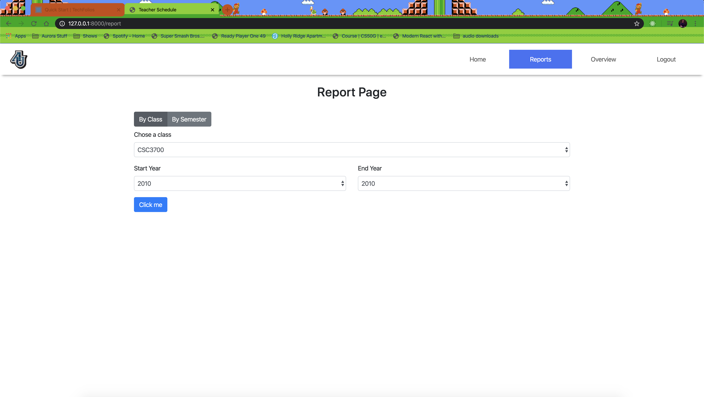

  This group project was done for a final project for CSC3700 Advanced Web App at Aurora University. This project included me and three other team members.

Source: <a href="https://github.com/nengler/CSC3700TeacherSchedule"><i class="large github icon"></i>3700TeacherScedule</a>
